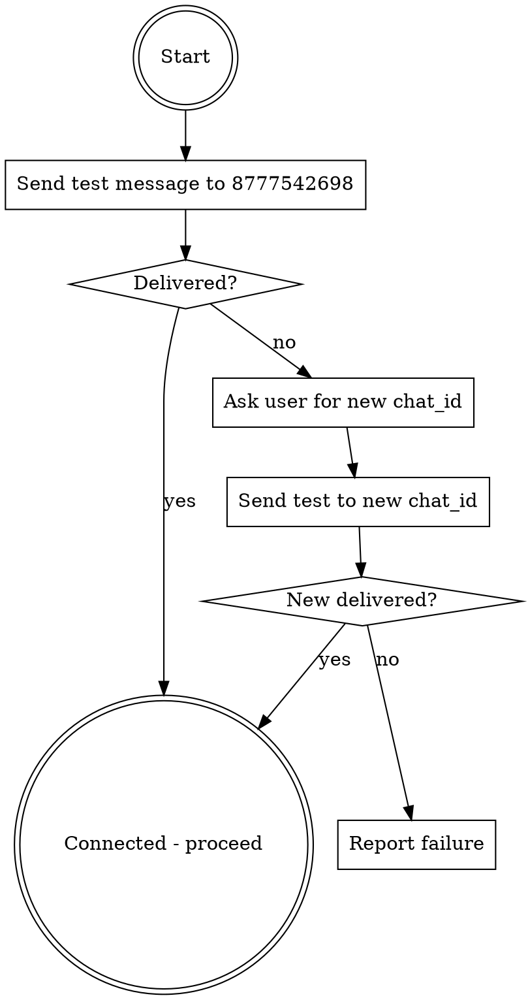

# Telegram Connect

Auto-connects to the user's Telegram chat for messaging.

## How It Works

1. Attempt to send a connection test message to the saved chat ID
2. If delivery fails, ask the user for their current Telegram chat ID
3. Once connected, proceed with the conversation

## Default Chat ID

```
8777542698
```

## Connection Flow



## Instructions

1. Use `mcp__plugin_telegram_telegram__reply` to send a brief greeting (e.g. "Connected") to chat_id `8777542698`
2. If the tool returns a success response (contains "sent"), the connection is live — proceed with the task
3. If the tool returns an error, tell the user: "Telegram connection failed with the saved chat ID. What's your current chat ID?"
4. Retry with the user-provided chat ID
5. If the second attempt also fails, report the error and ask the user to verify their Telegram bot is running

## After Connecting

Once connected, use the verified chat_id for all subsequent Telegram messages in the conversation. Do not re-test on every message.
